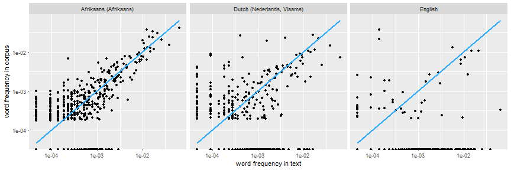
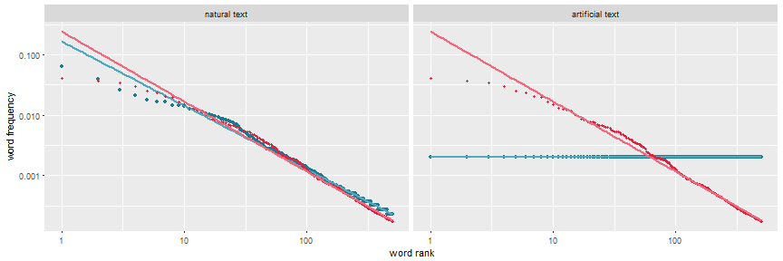

Language Detection Shiny App
========================================================
author: Sébastien Pujadas
date: 26th February 2017
width: 1680
height: 1050

Overview
========================================================

- This app determines the language(s) that a user-supplied text is possibly written in, and then enables the user to select one of the top-scoring languages to visualise word frequencies in the text and in the language's corpus

- All the plots in the app are interactive

- **Supported languages** (and corresponding two-letter ISO 639-1 code)

  Afrikaans (`af`), Breton (`br`), Bosnian (`bs`), Catalan (`ca`), Czech (`cs`), Danish (`da`), German (`de`), English (`en`), Esperanto (`eo`), Spanish (`es`), Estonian (`et`), Basque (`eu`), Finnish (`fi`), French (`fr`), Galician (`gl`), Croatian (`hr`), Hungarian (`hu`), Indonesian (`id`), Icelandic (`is`), Italian (`it`), Lithuanian (`lt`), Latvian (`lv`), Malay (`ms`), Dutch (`nl`), Norwegian (`no`), Polish (`pl`), Portuguese (`pt`), Romanian (`ro`), Slovak (`sk`), Slovene (`sl`), Albanian (`sq`), Serbian (`sr`), Swedish (`sv`), Tagalog (`tl`), Turkish (`tr`)

- **Data source for the language corpora**

  [2016 OpenSubtitles Frequency Word Lists](https://github.com/hermitdave/FrequencyWords/)

- **Source code**

  Published on GitHub at https://github.com/spujadas/coursera-ddp-shiny

Scoring the text
========================================================
class: small-code

- For each supported language, a score between 0 and 1 is assigned using a simple algorithm: the frequency of all the words in the text is calculated, and then the frequencies of the words that also appear in the top *n* (default: 500) most frequent words of the supported languages are added together

  - For Bosnian, Croatian, and Serbian, the number of words used to detect the language should be increased as the default 500 words may not be enough to discriminate between these three (similar) languages
  
- The highest scores determine the languages that the text is probably written in

- The top 10 scores are shown as a bar graph in the app

***
***Example for the text [Oom Gert Vertel en Ander Gedigte](http://www.gutenberg.org/cache/epub/19729/pg19729.txt):***


```
   language      score                   langName
1        af 0.69075677      Afrikaans (Afrikaans)
24       nl 0.48370466 Dutch (Nederlands, Vlaams)
8        en 0.17943289                    English
7        de 0.16350580           German (Deutsch)
4        ca 0.12437857           Catalan (català)
2        br 0.12378015         Breton (brezhoneg)
15       gl 0.10688639          Galician (galego)
33       sv 0.10127048          Swedish (svenska)
6        da 0.09514822             Danish (dansk)
14       fr 0.08833548          French (français)
```


*The highest scoring language is Afrikaans, and the text is indeed actually written in Afrikaans.*

Properties of the word frequencies in the corpus and in the text
========================================================

- In the language that the text is written in, the frequencies of the words in the corpus and in the text tend to be similar, especially for the most frequent words, as can be seen in the word frequencies plot

  * In the actual language of the example text (leftmost plot), there are many points, and they tend to be grouped around the <span class="equal-frequencies">line of equal frequencies</span>, especially at higher frequencies
  
  * In the two next best candidate languages, there are less points and they are more scattered.



***

- [Zipf's law](https://en.wikipedia.org/wiki/Zipf%27s_law) states that in a **natural language**, the frequency of any word is inversely proportional to its rank in the frequency table
  
  * The leftmost part of the plot below show the word frequencies in the previous <span class="user-text">example text</span> and in the Afrikaans <span class="corpus-text">corpus</span>, according to their rank: the distributions of the frequencies are similar
  
  * The rightmost part of the plot replaces the example text with an <span class="user-text">artificial text</span> consisting of the 500 most frequent words in Afrikaans, each used exactly once: the distributions are completely different
  


Going further
========================================================

- **Scoring algorithm**

  The algorithm used in this app obtains accurate results, the scoring function^1 could however be improved to:

  * Further discriminate between similar languages (e.g. Bosnian, Croatian, and Serbian)

  * Support languages that use non-Latin scripts (e.g. Chinese, Arabic, Hindi)

- **Corpora**

  The corpora for the supported languages are based on subtitles of TV series and films, and are therefore biased towards the spoken form of the languages.

  *For instance, first and second person pronouns such as "I" or "you" appear more frequently than in traditional written works*

  Additional or alternative corpora could be created^2 to handle other forms of the languages (e.g. non-fiction and fiction written works, online forums and chats) and obtain better results depending on the type of input that is fed to the app.

<div class="footer" style="">
<sup>1</sup> <code>languageScore()</code> function in the <code>language-detection.R</code> source file.
<br/>
<sup>2</sup> The comments accompanying the <code>readLanguageFrequencyData()</code> function decribe the structure of the corpus files.
</div>
